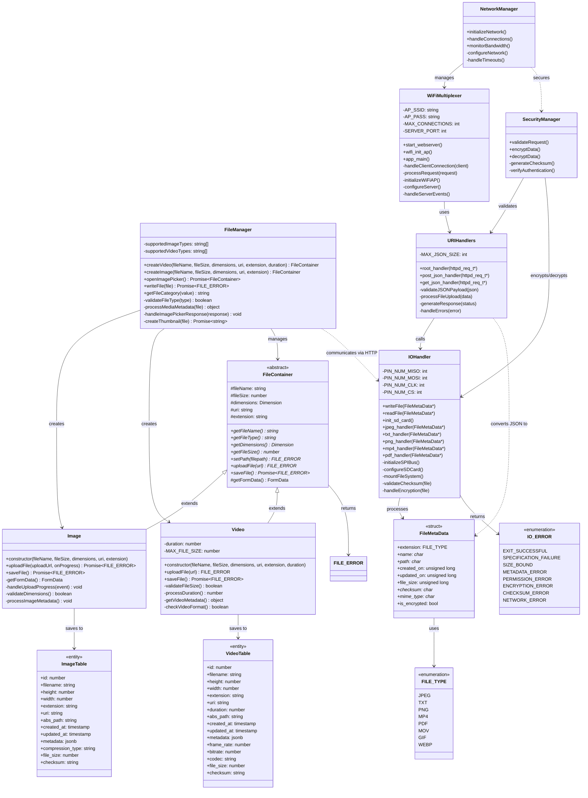

## Table of Contents
- [Introduction](#introduction)
- [Literature Review](#literature-review)
- [Overview](#overview)
- [Hardware Component](#hardware-component)
- [Software Component](#software-component)
- [Database Schema](#database-schema)
- [Technology Stack](#technology-stack)
  - [Frontend Stack](#frontend-stack)
  - [Backend Stack](#backend-stack)
- [System Architecture](#system-architecture)
- [UML Overview](#uml-overview)

## Introduction
In today’s data-driven world, devices with limited internal storage often leave users facing a dilemma: meticulously sorting through their data to delete what they deem least valuable or resorting to costly upgrades and cloud storage solutions. While cloud storage introduces recurring expenses and potential privacy concerns, upgrades for mobile devices remain expensive and, in some cases, unavailable.


Paradoxically, the cost of computer memory and storage has steadily declined over the years, yet the price of increasing a mobile device’s storage capacity between different storage tiers has not mirrored this decline in cost . Alongside the increasing cost discrepancy between storage tiers for mobile devices is the storage limitation that users face as they are often locked into a fixed storage capacity at the time of purchase, with no option to expand it later beyond monthly subscriptions to a cloud service .


These issues highlight a gap; an opportunity to explore alternative solutions that balance affordability, scalability, and the user's control over his/her data.

This project emerges from a vision to bridge this gap. By combining a cross-platform software application with a portable hardware component, it aims to provide users with a seamless, wireless means of expanding their device storage.


## Literature Review
The Internet of Things (IoT) has become a driving force in modern technology, enabling seamless automation, real-time data exchange, and intelligent decision-making. Its impact is particularly evident in smart homes, cities, and industries, where IoT-powered systems enhance efficiency and user convenience. However, IoT devices, including smartphones, remain constrained by limited processing power, security vulnerabilities, and insufficient storage capacity[5][6]. Unlike laptops, which allow for expandable storage via external drives, smartphones rely on fixed internal storage, a limitation further exacerbated by the widespread removal of SD card slots. Apple has never supported expandable storage on any iPhone model, requiring users to rely solely on internal storage and iCloud. Similarly, Google’s Pixel series has always lacked SD card slots, while Samsung eliminated expandable storage from its Galaxy S series starting with the S21, as well as from its Galaxy Note lineup after the Note 5. Which leaves their users with limited storage options. Consequently, smartphone owners often face the challenge of either deleting valuable data, upgrading to expensive models with higher storage, or subscribing to cloud storage services, which have drawbacks such as high costs and privacy concerns. 

Existing research has explored IoT-based data storage solutions, including blockchain-based architectures [7], edge computing​, and cloud optimization techniques [6]. Edge computing has become a key strategy in addressing storage and processing limitations by reducing cloud dependency and decentralizing data management [4]. Unlike traditional cloud storage, which relies on centralized servers, edge computing enables data processing closer to the device, reducing latency, bandwidth usage, and network congestion[9]. Studies have shown that edge-fog-cloud hierarchical storage models significantly enhance efficiency by distributing data across multiple levels, ensuring that frequently accessed data remains readily available at the edge layer, while less critical data is transferred to cloud storage for long-term retention​​ [9]. Additionally, edge-based caching mechanisms improve data accessibility by storing frequently used files locally, reducing the need for continuous data retrieval from the cloud [9], which would be very useful for smartphone users who rely on cloud storage but often face latency issues when accessing large files. 

While blockchain technology has been proposed to enhance security and reliability in IoT storage solutions [9]​, it does not fully address the need for real-time, low-latency access to data, making edge computing a more viable alternative for smartphone storage expansion. Studies have also explored the use of wireless networks and mobile applications emphasize their role in enhancing IoT communication, particularly through Bluetooth and Wi-Fi technologies, which improve device interactivity and enable remote control functionalities [1][2]​, highlighting the potential of edge-enabled mobile storage solutions to offer a seamless, scalable, and secure approach to managing storage on smartphones.

Researchers have also focused on bandwidth-efficient storage mechanisms that reduce network strain in IoT environments [11]​ and security enhancements for IoT data storage, including encryption and authentication measures​ [8]. In the area of IoT-based storage, security remains the most important thing to consider, particularly concerning encryption and authentication measures. Research highlights that many NoSQL databases used in IoT storage often lack built-in encryption by default, making them vulnerable to cyberattacks if not properly configured​ [8]. Common threats include botnet attacks, ransomware, and malware infiltration, which can compromise stored data if security measures are not enforced [8]. To mitigate these risks, researchers emphasize the importance of encrypting data at rest and during transmission using protocols like TLS over SSL, role-based access controls, and multi-factor authentication mechanisms [8]. Furthermore, hybrid databases that combine relational (SQL) and NoSQL capabilities offer a balance between organized security and scalability, guaranteeing that important data is safeguarded while preserving performance effectiveness [8].
   
Despite these advancements, current research lacks a dedicated solution for smartphone users seeking an alternative to cloud-based storage. This project seeks to bridge these gaps by integrating IoT principles, wireless connectivity, and edge computing to develop an innovative smartphone storage expansion solution. By combining a portable hardware component with a user-friendly companion app, this approach leverages edge-based caching and decentralized storage to provide a cost-effective and user-controlled alternative to traditional storage limitations, offering smartphone users greater flexibility and autonomy over their data.


## Overview
The system will be centered around a hardware component that functions as a central storage unit alongside a companion app which will serve as an interface for the user to communicate with the hardware component . The mobile application will allow users to manage and expand their device storage wirelessly. Users will be able to upload, retrieve, and organize files securely, ensuring scalability and flexibility in their storage options. And the hardware component will serve as the central means for storing said files . 


## Hardware component

The hardware component will not only store data but also serve as a web streaming device, enabling real-time browsing and seamless access to the data stored within it. Key features of the hardware include:  

- **Expandable Storage**: Support for modular upgrades to increase storage capacity.  
- **Wireless Connectivity**: Integration with modern connectivity standards such as Wi-Fi.  
- **Portability**: A lightweight and energy-efficient design for on-the-go use.  
- **Data Security**: On-device encryption for secure data handling.  


## Software component

The system will feature a cross-platform application **( iOS & Android )**, designed to ensure identical functionality and a consistent user experience across both operating systems . The mobile application will serve as the primary interface for the user to communicate with the hardware component . The application’s key roles include:  

- **Data Management**: Facilitate file uploads, downloads, and organization.  
- **Real-Time Monitoring**: Display the status of the hardware, including storage usage ,  active connections , and battery % .  
- **Streaming Interface**: Provide a user-friendly interface for real-time data browsing and streaming. 


## Database schema

```sql
-- Users Table
CREATE TABLE Users (
  user_id INT PRIMARY KEY,
  username VARCHAR(255) NOT NULL,
  password VARCHAR(255) NOT NULL,
  email VARCHAR(255) NOT NULL,
  first_name VARCHAR(255),
  last_name VARCHAR(255)
);

-- Roles Table
CREATE TABLE Roles (
  role_id INT PRIMARY KEY,
  role_name VARCHAR(255) NOT NULL
);

-- UserRole Table
CREATE TABLE UserRole (
  user_id INT,
  role_id INT,
  PRIMARY KEY (user_id, role_id),
  FOREIGN KEY (user_id) REFERENCES Users(user_id),
  FOREIGN KEY (role_id) REFERENCES Roles(role_id)
);

-- Files Table
CREATE TABLE Files (
  file_id INT PRIMARY KEY,
  file_name VARCHAR(255) NOT NULL,
  file_size INT NOT NULL,
  extension VARCHAR(10),
  creation_time TIMESTAMP,
  last_access TIMESTAMP,
  permissions VARCHAR(255)  -- e.g., 'user: read, write'
);

-- Directory Table
CREATE TABLE Directory (
  directory_id INT PRIMARY KEY,
  directory_name VARCHAR(255) NOT NULL,
  directory_size INT NOT NULL,
  number_of_files INT NOT NULL,
  creation_time TIMESTAMP,
  last_access TIMESTAMP,
  permissions VARCHAR(255),  -- e.g., 'user: read, write'
  parent_directory INT DEFAULT NULL,
  FOREIGN KEY (parent_directory) REFERENCES Directory(directory_id)
);

-- FileLocation Table
CREATE TABLE FileLocation (
  file_id INT,
  directory_id INT,
  path VARCHAR(255),
  previous_location INT DEFAULT NULL,
  PRIMARY KEY (file_id, directory_id),
  FOREIGN KEY (file_id) REFERENCES Files(file_id),
  FOREIGN KEY (directory_id) REFERENCES Directory(directory_id),
  FOREIGN KEY (previous_location) REFERENCES Directory(directory_id)
);
```

## Technology Stack

### Frontend Stack (Mobile Application)

- **React Native v0.77.0**: Cross-platform mobile application framework
- **TypeScript v5.7.3**: Static typing and enhanced development experience
- **React v18.3.1**: UI component library
- **Redux**: Application state management (version unspecified in dependencies)
- **React Navigation v7.0.14**: Navigation management
  - Native Stack Navigator v7.2.0
  - Safe Area Context v5.2.0
  - Screens v4.6.0

### Data Tier 
- **TypeORM v0.3.20**: Object-Relational Mapping (ORM)
- **SQLite3 v5.1.7**: Local database engine

### Media Handling
- **React Native Image Picker v8.0.0**: Native media selection
- **@ffmpeg/ffmpeg v0.12.15** (Unmet Dependency): Media processing

### Development Tools
- **Babel v7.26.7**: JavaScript compiler
  - Core
  - Runtime
  - Preset ENV
  - Plugin Proposal Decorators
- **ESLint v8.57.1**: Code linting
- **Prettier v2.8.8**: Code formatting
- **Jest v29.7.3**: Testing framework

### Type Definitions
- **@types/react v18.3.18**
- **@types/react-native v0.73.0**
- **@types/node v22.13.1**
- **@types/jest v29.5.14**
- **@types/react-test-renderer v18.3.1**

## Backend Stack (ESP32)

### Core Framework
- **ESP-IDF**: Espressif IoT Development Framework
  - Native C/C++ development
  - FreeRTOS-based real-time operating system

### Key Components
- **SPI/SDMMC Interface**: SD card communication
- **File System**: FAT file system implementation
- **JSON Parser**: cJSON library for data handling

## System Architecture

### Frontend Architecture
1. **Presentation Layer**
   - React Native UI Components
   - React Navigation for routing
   - TypeScript for type safety

2. **State Management Layer**
   - Redux for global state
   - Local component state where appropriate

3. **Data Access Layer**
   - TypeORM for database operations
   - SQLite for local storage
   - File system access for media

## UML Overview 



## Tests

This section lists the test cases necessary to ensure the accuracy and resiliency of the system responsible for processing and storing the file's metadata.

### 1. Filename Truncation Tests

#### Test Case 1: Filename to exceed max length

**Input:** `averylongfilenamethatexceedsthemaxlimit.txt`  

**Expected Result:** Should truncate the filename to the max allowed length and store it correctly.

#### Test Case 2: Filename includes special characters

**Input:** `file_with_@#$%^&*()_chars.txt`  

**Expected Result:** Special characters should not cause truncation issues or database errors.

#### Test Case 3: Filename including spaces

**Input:** `file with spaces.txt`  

**Expected Result:** Space-character preservation or replacement according to the system policy.

#### Test Case 4: Filename contains non-ASCII characters

**Input:** `文件名测试.txt` (Chinese language)  

**Expected Result:** Unicode filenames, should be properly supported without any truncation concerns.

#### Test Case 5: Filename with no extension

**Input:** `file_without_extension`  

**Expected Result:** Truncated filename according to rules with no side effects on the main functionality.

#### Test Case 6: Filename having much more than one dot

**Input:** `my.archive.file.name.txt`  

**Expected Result:** Filename truncation is to take place, while the extension ought to remain intact. 

#### Test Case 7: Empty filename

**Input:** `""`  

**Expected Result:** Default name could be assigned by the API, or empty filenames should be rejected.

### 2. JSON Handling Tests

#### Test Case 8: Valid JSON with fully populated required fields

**Input:** Well-formed JSON containing the five fields of `fileExtension`, `filename`, `filePath`, `createdOnInUTC`, and `updatedInUTC`.  

**Expected Result:** The file metainformation is parsed and stored correctly. 

#### Test Case 9: JSON lacks required fields

**Input:** JSON that omits either `filename` or `fileExtension`.  

**Expected Result:** API response specifies the missing fields.

#### Test Case 10: Malformed JSON

**Input:** Corrupted JSON structure.  

**Expected Result:** The API identifies invalid JSON and displays an appropriate error.

#### Test Case 11: File extension as invalid string

**Input:** `"fileExtension": "INVALID"`  

**Expected Result:** API rejected or gracefully handles unknown file types.

#### Test Case 12: File extension is unexpected integer

**Input:** `"fileExtension": 999`  

**Expected Result:** API returns an error or assigns a default file type.

### 3. SD Card Handling Tests

#### Test Case 13: SD card not mounted

**Expected Result:** API returns improper error response indicating missing storage.

#### Test Case 14: SD card full

**Expected Result:** API indicates insufficient storage space.

#### Test Case15: SD card write-protected

**Expected Result:** API properly detects the write error under read-only condition.

### 4. Error Handling & Edge Cases

#### Test Case 16: High load test

**Input:** Numerous requests to JSON invoked at once.  

**Expected Result:** Thus, the system will withstand plenty of work without observable lag.

#### Test Case 17: Corrupt or unexpected binary data

**Input:** Random binary input, not JSON.  

**Expected Result:** The API should reject the request and log the event.

#### Test Case 18: File having maximum allowed path length

**Input:** `"filePath": "C:/very/long/path/to/file/that/reaches/max/limit.txt"`  

**Expected Result:** The system should effectively manage long file paths as per defined requirements.

#### Test Case 19: Rush requests with same filename

**Input:** Multiple requests using the same filename in quick succession.  

**Expected Result:** API guarantees consistency of stored information free of conflicts and corruption.

#### Test Case 20: Unexpected NULL in JSON fields

**Input:** JSON that will provide `null` values for mandatory fields.  

**Expected Result:** API properly handles `null` values by rejecting them or assigning defaults.

## Conclusion
Some content here...

## References
[1] H. Benouda, M. Lachgar, S. Elfirdoussi, C. Ait Zaouiat, and H. Kabaili, "IoT Devices Controlled Using Mobile Apps," MENACIS2020, 2020. [Online]. Available: https://aisel.aisnet.org/menacis2020/1.. 

[2] A. Muc, A. Bielecka, and J. Iwaszkiewicz, "The use of wireless networks and mobile applications in the control of electric machines," Applied Sciences, vol. 13, no. 1, p. 532, 2023. [Online]. Available: https://doi.org/10.3390/app13010532. 

[3] H. Jiang, F. Shen, S. Chen, K.-C. Li, and Y.-S. Jeong, "A secure and scalable storage system for aggregate data in IoT," Future Generation Computer Systems, vol. 49, pp. 133–141, 2015. [Online]. Available: https://doi.org/10.1016/j.future.2014.11.009. 

[4] K. Ergun, R. Ayoub, P. Mercati, and T. Š. Rosing, "Dynamic reliability management of multigateway IoT edge computing systems," IEEE Internet of Things Journal, vol. 10, no. 5, pp. 3864–3879, 2023. [Online]. Available: https://doi.org/10.1109/JIOT.2022.3185082. 

[5] S. Kumar, P. Tiwari, and M. Zymbler, "Internet of Things is a revolutionary approach for future technology enhancement: A review," Journal of Big Data, vol. 6, no. 1, p. 111, 2019.  [Online]. Available: https://doi.org/10.1186/s40537-019-0268-2.

[6] K. Hossain, M. Rahman, and S. Roy, "IoT Data Compression and Optimization Techniques in Cloud Storage: Current Prospects and Future Directions," International Journal of Cloud Applications and Computing, vol. 9, no. 2, pp. 43-59, 2019. [Online]. Available: https://doi.org/10.4018/IJCAC.2019040103.

[7] A. A. Maftei, A. Lavric, A. I. Petrariu, and V. Popa, "Massive Data Storage Solution for IoT Devices Using Blockchain Technologies," Sensors, vol. 23, no. 3, p. 1570, 2023. [Online]. Available: https://doi.org/10.3390/s23031570.

[8] S. Malo, "Securing Internet of Things (IoT) Data Storage," University of New Hampshire Honors Theses and Capstones, 2024. [Online]. Available: https://scholars.unh.edu/honors/829.

[9] A. Barron, D. D. Sanchez-Gallegos, D. Carrizales-Espinoza, J. L. Gonzalez-Compean, and M. Morales-Sandoval, "On the Efficient Delivery and Storage of IoT Data in Edge–Fog–Cloud Environments," Sensors, vol. 22, no. 7016, 2022. [Online]. Available: https://doi.org/10.3390/s22187016.

[10] A. Muc, A. Bielecka, and J. Iwaszkiewicz, "The Use of Wireless Networks and Mobile Applications in the Control of Electric Machines," Applied Sciences, vol. 13, no. 532, 2023. [Online]. Available: https://doi.org/10.3390/app13010532.

[11] X. Zhao, D. E. Lucani, X. Shen, and H. Wang, "Reliable IoT Storage: Minimizing Bandwidth Use in Storage Without Newcomer Nodes," International Journal on IoT and Cloud Computing, 2018. [Online]. Available: https://pure.au.dk/portal/en/publications/reliable-iot-storage-minimizing-bandwidth-use-in-storage-without-.


____
Tags : #programming #computer-architecture #graphite