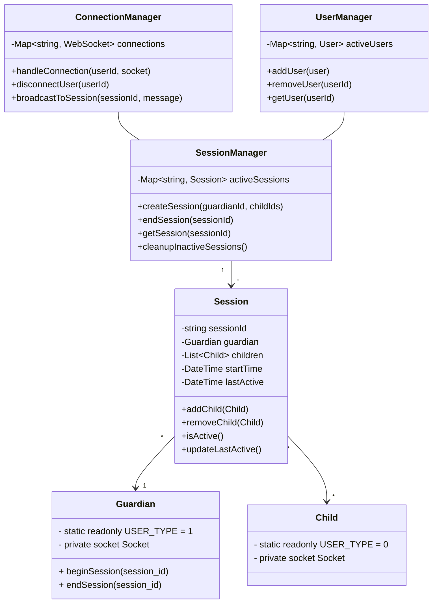

### User 
___
- `user_type` : used to delineate user type ( *1* represents guardian whereas *0* represents a child ) . 
- `user_id` : Unique User Identifier ( *UUID* ) number representing the user . 
- `first_name` : First name of user 
- `last_name` : Last name of user 
- `email` : email address of user 

### Guardian 
___
**Extends user**
- `static readonly USER_TYPE` : signifies Guardian  . 
- `private socket Socket` : Socket associated with the users 
+ `beginSession(session_id)` : send begin signal to signal manager
+ `endSession(session_id)` : sends end signal to signal manager
### Child 
___
**Extends user**
- `static readonly USER_TYPE` : signifies Guardian  . 
- `private socket Socket` : Socket associated with the users 

___

Tags : #programming #keeper #system-design 