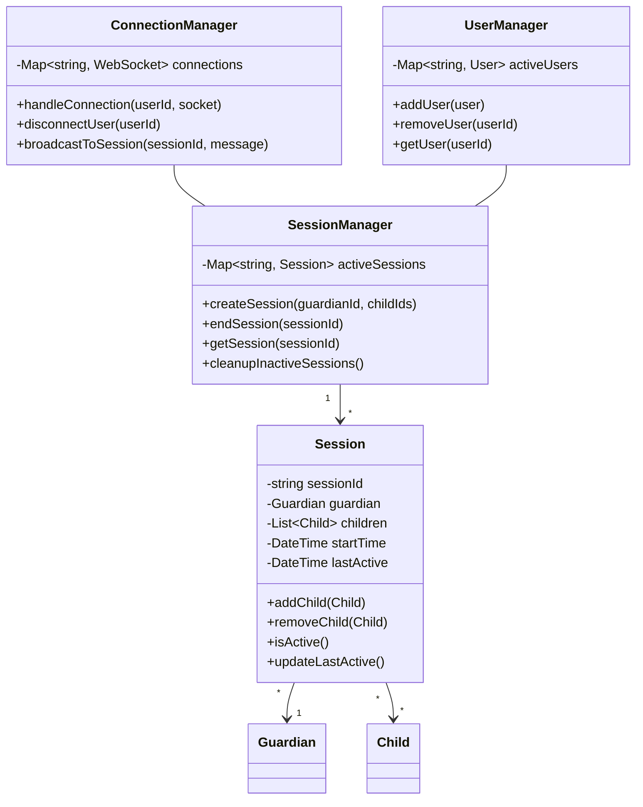

Let me analyze the design approach shown in the diagram and provide recommendations.

Current Design Overview:
1. The server maintains objects for Sessions, Guardians, and Children
2. When a user logs in, the system creates appropriate objects and stores them in containers
3. Sessions connect guardians and children via websockets to enable app locking functionality
4. The design uses a centralized server to manage these relationships and session states

Regarding your questions:

1. Is storing objects server-side good?
Yes, this approach has several benefits:
- Centralized state management
- Easier session coordination between guardians and children
- Real-time control over app locking features
- Simpler synchronization of session states

However, there are some considerations:

2. When to destroy objects:
You should implement object cleanup in these scenarios:
- When sessions explicitly end
- When users log out
- When websocket connections are terminated
- After a period of inactivity
- When the guardian terminates the monitoring session

3. Potential improvements:

Recommended improvements:

1. Implement Manager Classes:
- SessionManager: Handles session lifecycle
- ConnectionManager: Manages websocket connections
- UserManager: Handles user state and authentication

2. Add State Management:
- Track session activity status
- Implement timeout mechanisms
- Add heartbeat monitoring for connections

3. Memory Management:
- Implement cleanup routines for inactive sessions
- Use weak references where appropriate
- Add session expiration policies

4. Error Handling:
- Handle disconnections gracefully
- Implement reconnection logic
- Add session recovery mechanisms

5. Scalability Improvements:
- Consider using Redis/Memcached for session storage
- Implement horizontal scaling capabilities
- Add load balancing support

6. Monitoring and Logging:
- Add session analytics
- Track system resources
- Implement proper logging

The current approach is generally sound, but these improvements would make it more robust and maintainable. Would you like me to elaborate on any of these aspects?
___

Tags : #programming #keeper #system-design 