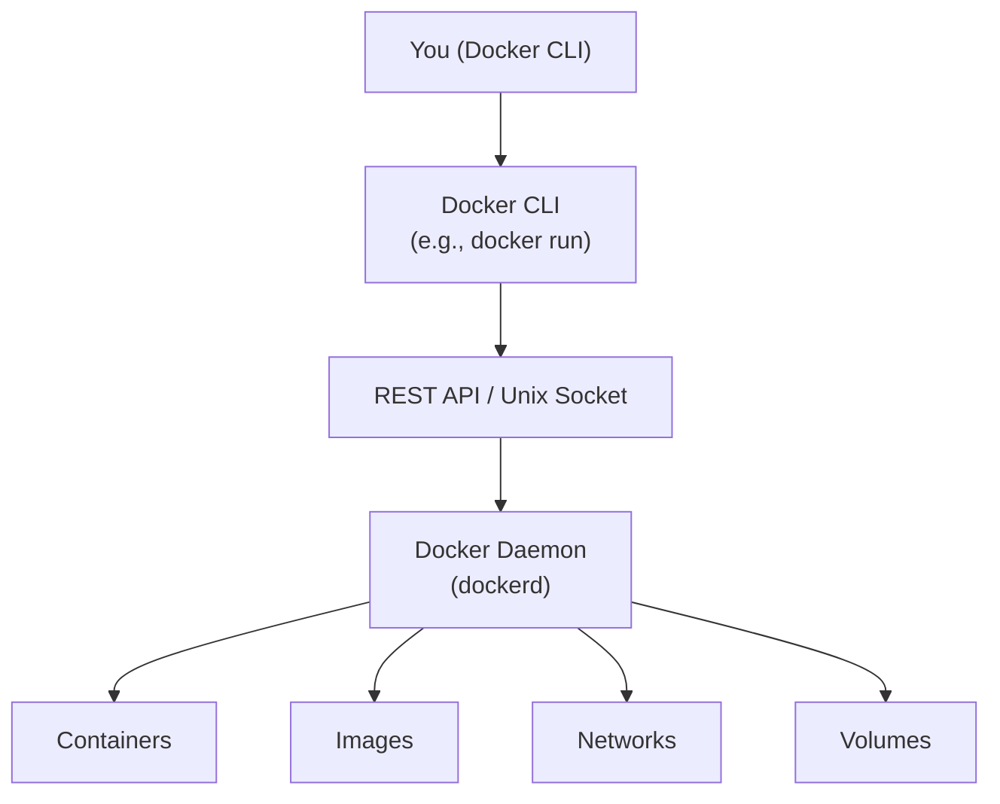

the docker [[Daemon]] is the **core background service that manages everything Docker does**. The docker CLI which we issue commands to like `docker build` and `docker run` is just a client. The requests get sent to the docker daemon running in the background ( or foreground using `sudo nohup dockerd > /dev/null 2>&1 &` ) does all the heavy lifting. We must start this Daemon process prior to doing anything using the `dockerd` command. 

___
Tags: #docker