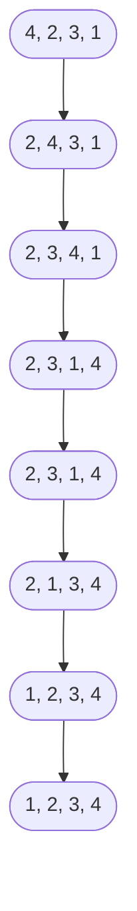

We must specify ...
- Initial State
- Actions 
- Goal State 
- State Transition Function 
- Cost of action 

#### Example 
___
**Bubble sort problem**
- Initial State
- Actions 
- Goal State 
- State Transition Function 
- Cost of action 
  
______

**

#### 2. Evaluation Function

The evaluation function is designed to guide the search effectively by calculating the Hamming Distance between the current state and the goal state. The heuristic used is:

H(state) =number of misplaced smaller disks relative to their target position groupings\text{H(state)} = \text{number of misplaced smaller disks relative to their target position groupings}H(state)=number of misplaced smaller disks relative to their target position groupings

  
  

This heuristic works by:

1. Counting the number of smaller disks that are not part of their correct group (e.g., disks labeled 1 not being adjacent to other 1s).
    
2. Penalizing states where a larger disk remains uncovered unnecessarily, indicating poor progress toward the goal.
    

This evaluation encourages moves that cluster smaller disks of the same label and prioritize exposing useful large disks.

#### 3. State Space Representation

The state space is represented as two lists:

- Large disks: A circular list where each element corresponds to the number stamped on a large disk. A 0 indicates the uncovered large disk.
    
- Smaller disks: A list of smaller disks placed on top of their corresponding large disks. The positions of the smaller disks directly reflect the state of the puzzle.
    

Each state transition involves:

- Choosing one of the smaller disks allowed by the uncovered large disk.
    
- Moving that smaller disk to cover the uncovered large disk.
    

The state is uniquely represented by these two lists, ensuring clear tracking of moves.

**

Tags : #programming #artificial-intelligence